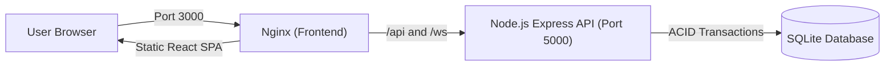

# Dhaka Tesla Pool ⚡🛺

> **Share a seat. Split the fare. Survive Dhaka traffic.**

An electric ride-pooling system built for the Banani rush hour, featuring **Jashim** and his 3-seat electric "Tesla" named **Bullet**, carrying commuters **Nusrat**, **Rafiq**, and **Shirin**.

---

## Quick Start with Docker (Recommended)

Run the entire app (frontend, backend API, database, and seed data) with one command:

```bash
# 1. Copy the environment template
cp .env.example .env

# 2. Build and start containers
docker compose up --build
```

- **Web App**: [http://localhost:3000](http://localhost:3000)
- **API Health Check**: [http://localhost:5000/api/health](http://localhost:5000/api/health)

*(To stop the containers: `docker compose down`)*

---

## Running Locally (Without Docker)

### 1. Start Backend API
```bash
cd backend
npm install
npm run build
npm start
```
*API runs at `http://localhost:5000`*

### 2. Start Frontend UI
```bash
cd ../frontend
npm install
npm run dev
```
*Frontend runs at `http://localhost:3000`*

### 3. Run Automated Tests
```bash
cd backend
npm test
```
*Runs all 15 test suites covering capacity limits, state transitions, and concurrency.*

---

## Pre-Seeded Story Cast

The database automatically seeds the PRD cast on the first run. You can log in with:

| Character | Role | Email | Password | Starting Wallet | Details |
| :--- | :--- | :--- | :--- | :--- | :--- |
| **Jashim Uddin** | Driver (Pilot) | `jashim@tesla.dhaka` | `password123` | ৳1,500.00 | Pilot of **Bullet** (3 seats, 84% battery) |
| **Nusrat Jahan** | Passenger | `nusrat@banani.dhaka` | `password123` | ৳800.00 | Books Banani $\rightarrow$ Mohakhali |
| **Rafiq Ahmed** | Passenger | `rafiq@gulshan.dhaka` | `password123` | ৳650.00 | Books Banani $\rightarrow$ Gulshan 1 |
| **Shirin Akter** | Passenger | `shirin@mohakhali.dhaka` | `password123` | ৳500.00 | Grabs the 3rd & final seat |

*(The web interface also includes 1-click quick persona switcher buttons in the navbar).*

---

## How It Works

### 1. Vehicle Capacity Invariant
- Bullet has a strict capacity of **3 passenger seats**.
- Enforced at both the database level (`CHECK (occupied_seats <= 3)`) and inside atomic transactions (`BEGIN IMMEDIATE`) so seats can never be overbooked.

### 2. Corridor Matching
- 10 predefined Dhaka areas (Banani, Gulshan 1 & 2, Mohakhali, Farmgate, Dhanmondi, Mirpur 10, Uttara, Badda, Tejgaon).
- If two passengers travel along the same corridor (e.g. Banani $\rightarrow$ Mohakhali and Banani $\rightarrow$ Gulshan 1), the system recognizes them as overlapping and eligible to share Bullet.

### 3. Fare Calculation & Integer Poysha
- **Formula**: `Fare = Base Fare (৳30) + Distance (৳15/km) - Pool Discount (25%)`
- **Integer Poysha**: All money is calculated and stored as integer Poysha (1 BDT = 100 Poysha) to avoid floating-point rounding errors.

### 4. Ride Lifecycle
```
REQUESTED ──> MATCHED ──> DRIVER_ARRIVED ──> STARTED ──> COMPLETED
     │
     └──> CANCELLED (releases seat if cancelled before trip starts)
```

---

## System Architecture



### Database Tables
- **`users`**: Passenger and driver profiles, roles, and TeslaPay wallet balances.
- **`vehicles`**: Vehicle specs, driver assignment, battery level, and fixed capacity (3).
- **`pools`**: Active pooling sessions, occupied seats, and corridor direction.
- **`ride_requests`**: Individual ride bookings, pickup/destination, fare breakdown, and status.
- **`pool_memberships`**: Links passenger ride requests to a shared vehicle pool.
- **`audit_logs`**: Record of every booking, match, lifecycle change, and cancellation.

---

## Tech Stack Choices

- **Frontend**: React 19 + TypeScript + Vite + Tailwind CSS.
- **Backend**: Node.js + Express + WebSocket (`ws`).
- **Database**: SQLite (built-in Node 22 `DatabaseSync` with WAL mode and ACID transactions).
- **Docker**: Multi-stage build with Nginx reverse proxy.

---

## AI Usage Disclosure (PRD Section 8)

- **Tools Used**: Claude, ChatGPT, Cursor.
- **Purpose**: Boilerplate scaffolding, Tailwind CSS layout styling, and test cases.
- **Accepted Suggestion**: Using Docker Compose health check with native Node.js `fetch` to keep the Docker image small without needing `curl`.
- **Rejected Suggestion**: An AI suggested instantly auto-matching passengers without driver approval. We rejected this because in real Dhaka transit, the driver (Jashim) needs to see who is riding and explicitly accept them.

---

## Demo Video

- **Walkthrough Video**: `[Insert 6-minute Loom link here]`
