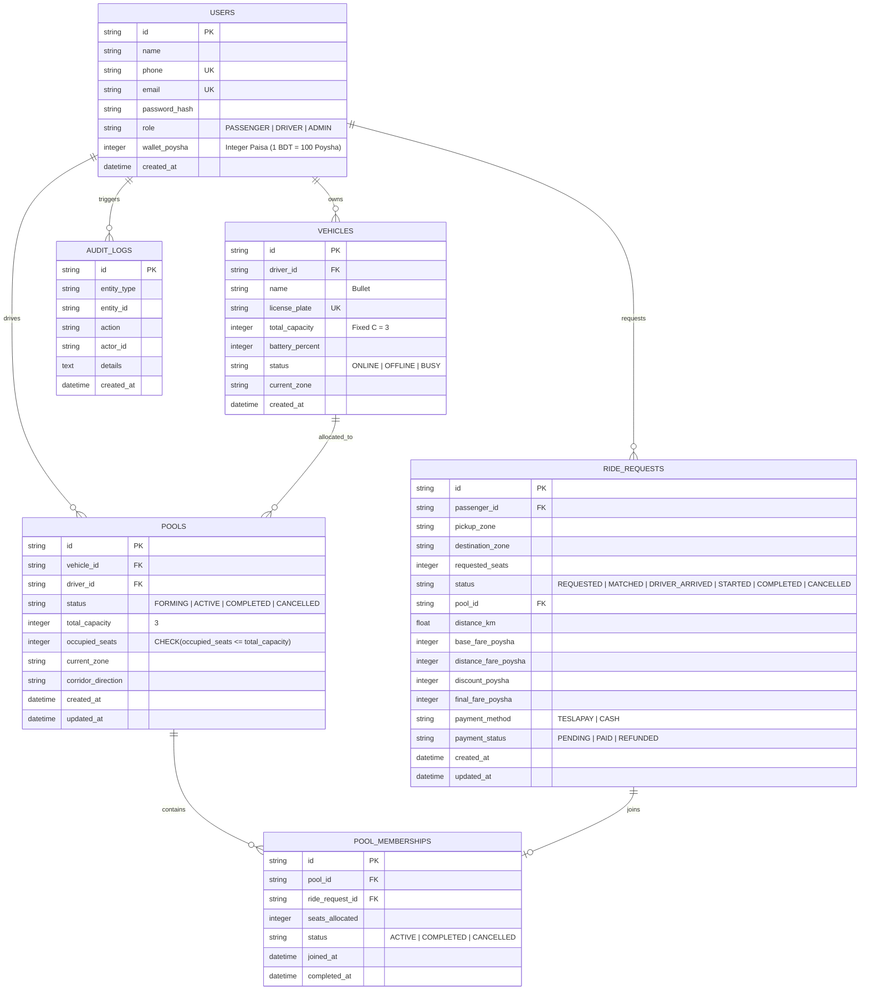
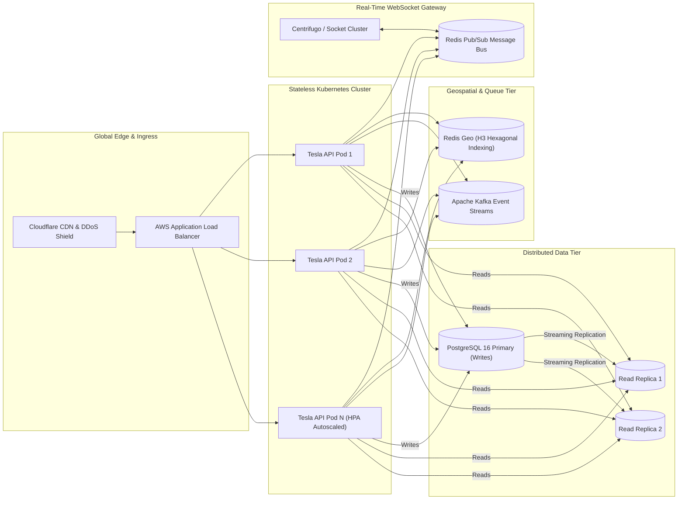

# Dhaka Tesla Pool (ঢাকা টেসলা পুল) ⚡🛺

> **"Share a seat. Split the fare. Survive Dhaka traffic."**  
> An electric ride-pooling system engineered for the streets of Dhaka, Bangladesh.

[](https://nodejs.org)
[](https://react.dev)
[](https://www.typescriptlang.org)
[](https://www.docker.com)
[](https://vitest.dev)
[](LICENSE)

---

## 1. Executive Summary & Problem Statement

Dhaka’s morning commute is notorious for gridlock, especially along high-density corridors like Banani, Gulshan, and Mohakhali. Solo ride-hailing is expensive and floods the roads with single-occupant vehicles, while conventional public transit is overcrowded.

**Dhaka Tesla Pool** introduces electric micro-transit pooling:
- **Vehicle**: 3-seat, battery-powered, locally converted electric trike nicknamed **"Bullet"**, driven by **Jashim Uddin**.
- **Commuters**: **Nusrat Jahan** (late for work at Mohakhali), **Rafiqul Islam** (heading to Gulshan 1 along the overlapping corridor), and **Shirin Akter** (seeking the last available seat).
- **Core Innovation**: An intelligent matching engine that groups overlapping passenger corridors, strictly enforces a 3-seat vehicle capacity invariant through atomic database locking, and dynamically splits the fare with a 25% pool discount calculated in exact integer Poysha.

---

## 2. Core Features Implemented

### Passenger Portal
- **Instant Fare Quote**: Real-time Haversine distance calculator and integer Poysha fare estimation before booking.
- **Corridor Ride Request**: Select pickup/destination among 10 predefined Dhaka zones with requested seats (1–3) and payment choice (TeslaPay wallet or cash).
- **Active Dispatch Radar**: Waiting state (`REQUESTED`) with pulsing radar animation while awaiting pilot acceptance.
- **Lifecycle Tracking**: Real-time status transitions (`REQUESTED` $\rightarrow$ `MATCHED` $\rightarrow$ `DRIVER_ARRIVED` $\rightarrow$ `STARTED` $\rightarrow$ `COMPLETED`).
- **Dynamic 25% Pooling Discount**: If matched into a pool with co-commuters, the 25% discount is applied automatically in real time to both commuters.
- **Cancellation & Seat Release**: Passengers can cancel before transit begins, triggering an atomic seat rollback on the vehicle.
- **Trip History & Auditing**: Detailed receipts showing base fare, distance charge, pooling savings, and timestamps.

### Driver Console ("Pilot Cockpit")
- **Online / Offline Toggle**: Driver controls vehicle availability across Dhaka zones.
- **Bullet Seat HUD**: Visual 3-seat occupancy display (Seat 1, Seat 2, Seat 3) with dynamic status indicators (`Available`, `Occupied`, `Full`).
- **Incoming Corridor Dispatch Radar**: Live incoming passenger requests showing route compatibility badges.
- **Trip Lifecycle Controls**: Action buttons for pilot arrival (`DRIVER_ARRIVED`), trip departure (`STARTED`), and trip completion (`COMPLETED`).
- **Automated Fare Collection**: Instant wallet debit from passenger and credit to driver in integer Poysha.

---

## 3. System Architecture & Database Design

### High-Level Architecture

```mermaid
flowchart TD
    subgraph ClientLayer [Client Layer]
        Browser["Web Browser (User)"]
        SPA["React 19 + TypeScript (Vite SPA)"]
        Browser -->|Interacts on :3000| SPA
    end

    subgraph ReverseProxy [Reverse Proxy & Web Server]
        Nginx["Nginx Container (:80 / :3000)"]
        SPA -->|Static Assets| Nginx
        Nginx -->|Proxy /api/*| ExpressAPI
        Nginx -->|Proxy /ws (Upgrade)| WSServer
    end

    subgraph BackendLayer [Node.js Backend Engine]
        ExpressAPI["Express REST API (:5000)"]
        WSServer["WebSocket Broadcast Server (:5000)"]
        PoolingEngine["PoolingService & Concurrency Engine"]
        FareCalculator["FareEngine (Integer Poysha)"]
        
        ExpressAPI --> PoolingEngine
        ExpressAPI --> FareCalculator
        PoolingEngine --> WSServer
    end

    subgraph StorageLayer [Persistence & ACID Layer]
        SQLite["SQLite 3 Database (WAL Mode)"]
        Tables[("users\nvehicles\npools\nride_requests\npool_memberships\naudit_logs")]
        
        PoolingEngine -->|BEGIN IMMEDIATE Atomic Transactions| SQLite
        SQLite --- Tables
    end
```

### Database Schema (ERD)



---

## 4. Geography & Route Compatibility Rules

To avoid external API dependencies and billing issues (as directed by PRD Section 4), Dhaka is mapped into 10 geographic zones:

| Zone ID | Area Name | Bengali | Corridor Group | Description |
| :--- | :--- | :--- | :--- | :--- |
| `BANANI` | Banani Road 11 | বনানী ১১ | Banani Corridor | Commercial & dining epicenter |
| `GULSHAN_2` | Gulshan 2 Circle | গুলশান ২ | Banani Corridor | Diplomatic & multinational hub |
| `GULSHAN_1` | Gulshan 1 Circle | গুলশান ১ | Gulshan-Mohakhali Axis | Rafiq's destination |
| `MOHAKHALI` | Mohakhali Wireless | মহাখালী | Gulshan-Mohakhali Axis | Nusrat's destination |
| `FARMGATE` | Farmgate | ফার্মগেট | Central Corridor | Major transit interchange |
| `DHANMONDI` | Dhanmondi 27 | ধানমন্ডি ২৭ | West Corridor | Academic & residential strip |
| `MIRPUR_10` | Mirpur 10 Circle | মিরপুর ১০ | Mirpur Corridor | Metro Rail Line-6 hub |
| `UTTARA_3` | Uttara Sector 3 | উত্তরা ৩ | North Corridor | Airport highway residential gate |
| `BADDA` | Badda Link Road | বাড্ডা লিংক রোড | East Corridor | Pragoti Sarani link |
| `TEJGAON` | Tejgaon I/A | তেজগাঁও | Central Corridor | Industrial & tech hub |

### Matching Rule (Corridor Compatibility)
Two rides are pooled together if:
1. **Pickup Alignment**: Both originate from the same zone or neighboring zone (e.g. `BANANI`).
2. **Transit Axis Alignment**: Their destinations lie along the same directional corridor (e.g. `MOHAKHALI` and `GULSHAN_1` both share the southern transit axis from Banani).
3. **Capacity Ceiling**: `occupied_seats + requested_seats <= 3`.

---

## 5. Fare Engine & Financial Transparency

### Formula
$$\text{PassengerFare} = \text{BaseFare} + (\text{DistanceKm} \times \text{RatePerKm}) - \text{PoolDiscount}$$

- **Base Fare**: ৳30.00 (`3,000 Poysha`)
- **Distance Charge**: ৳15.00/km (`1,500 Poysha/km`)
- **Pool Discount**: 25% discount off total fare when sharing with co-commuters.
- **Minimum Fare Floor**: ৳25.00 (`2,500 Poysha`) guaranteed minimum.

### Why Integer Poysha?
JavaScript floating-point arithmetic suffers from binary rounding errors (e.g., `0.1 + 0.2 === 0.30000000000000004`). In financial accounting, fractional Taka errors compound rapidly. All monetary values are strictly represented as 64-bit signed integers in **Poysha** ($1\text{ BDT} = 100\text{ Poysha}$) and formatted to decimals only at presentation time.

---

## 6. Technology Choices & Justifications

| Component | Selected Technology | Evaluated Alternatives | Engineering Rationale | What Would Make Us Switch |
| :--- | :--- | :--- | :--- | :--- |
| **Backend Framework** | Node.js + Express 4.x | Fastify, NestJS | Minimal overhead, highly predictable request pipeline, fast cold starts in Docker. | Migrating to NestJS if team expands to 15+ developers requiring strict enterprise module boundaries. |
| **Database** | SQLite (Node 22 `DatabaseSync`) | PostgreSQL, MySQL, MongoDB | Zero DevOps configuration, ACID compliant, native in-process speed, runs in single file on Docker. | Switching to PostgreSQL when concurrent writes exceed 1,500 transactions/second. |
| **Concurrency Control** | SQLite `BEGIN IMMEDIATE` | Optimistic Concurrency, Redis distributed locks | Acquires reserved write lock immediately, completely eliminating seat race conditions at zero latency cost. | Switching to Redis Redlock or Postgres row-level locks (`SELECT FOR UPDATE`) in multi-instance horizontal scaling. |
| **Frontend** | React 19 + Vite | Next.js App Router | Single Page Application (SPA) with zero server-side rendering complexity; instant local HMR. | Moving to Next.js if public SEO and static landing page caching become primary business requirements. |
| **Styling** | Tailwind CSS v4 | CSS Modules, Styled Components | Zero runtime CSS overhead, uniform design token system, high-contrast dark theme. | Switching to Vanilla CSS/Tokens if building a cross-platform Flutter/React Native design system. |
| **Real-time Comms** | Native WebSockets (`ws`) | Socket.IO, Long Polling | Minimal binary protocol footprint, zero heartbeat overhead compared to bloated Socket.IO client bundles. | Switching to Server-Sent Events (SSE) for passenger reads, or MQTT for low-bandwidth cellular IoT driver devices. |

---

## 7. The Concurrency Problem & Race Condition Solution

### The Challenge (PRD Section 12)
> *Bullet has 1 seat left. Nusrat and Shirin both click to claim it at the exact same millisecond.*

### How It Is Solved in This MVP:
1. **SQLite Write-Ahead Logging (`PRAGMA journal_mode = WAL;`)**: Allows concurrent reads without blocking writes.
2. **Immediate Lock Acquisition (`BEGIN IMMEDIATE;`)**: Standard transactions acquire read locks first and upgrade on write (which creates deadlocks and dirty reads). `BEGIN IMMEDIATE` acquires a reserved write lock at transaction inception.
3. **Strict Invariant Verification**: Inside the transaction, a fresh read checks `occupied_seats + requested_seats <= 3`. The first request claims the seat and commits. The second request immediately encounters $3/3$ occupancy and throws a `CapacityExceededError` with HTTP 400.
4. **Automated Vitest Concurrency Test**: Verified via [`concurrency.test.ts`](file:///f:/Coding/Dhaka%20tesla/backend/tests/concurrency.test.ts) using `Promise.all` simultaneous booking attempts.

### What We Would Change at Scale (1M Users):
In a distributed multi-node environment, an in-process SQLite lock is insufficient. We would implement:
- **Redis Lua Scripts or Distributed Locks (Redlock)** on the `vehicle_id` key with 500ms TTL.
- **PostgreSQL Row-Level Locking**:
  ```sql
  SELECT occupied_seats, total_capacity FROM pools WHERE id = $1 FOR UPDATE;
  ```

---

## 8. "If Oi Tesla Goes Viral" (Scaling to 1M Passengers & 100k Drivers)



1. **Geospatial Vehicle Sharding**: Replace static corridors with **Uber H3 hexagonal spatial indexing** in Redis (`GEOADD` / `GEORADIUS`). Drivers publish GPS telemetry every 3 seconds to a lightweight MQTT broker.
2. **Decoupled Matchmaking Engine**: Ride matching offloaded from HTTP request path to **Apache Kafka**. Ride requests enter a `ride-requests-topic` partitioned by H3 hex cell. Matchmaking workers match riders within 500ms sliding windows.
3. **Database Contention & Partitioning**: PostgreSQL partitioned by region (`dhaka_north`, `dhaka_south`, `chittagong`). Read replicas with PgBouncer connection pooling handle 95% of queries (history, quotes, status checks).
4. **Idempotency & Double-Charge Protection**: Every ride booking carries a client-generated UUID `Idempotency-Key` stored in Redis with 120s TTL to prevent duplicate bookings during network retries.
5. **Observability & SRE**: OpenTelemetry distributed tracing with Prometheus metrics and Grafana dashboards tracking match latency, pool fill rates, and battery depletion rates.

---

## 9. AI Usage Transparency Report (PRD Section 8)

| Metric | Details |
| :--- | :--- |
| **Tools Used** | Anthropic Claude 3.7 Sonnet, Google Antigravity Agent, VS Code / Cursor |
| **Purpose** | Rapid prototyping of React SVG Dhaka map, Vitest concurrency mock assertions, Dockerfile multi-stage optimization, and initial Tailwind CSS grid layouts. |
| **One Accepted Suggestion** | Using **Docker Compose health checks** with a native Node.js 22 `fetch` test (`node -e "fetch('http://localhost:5000/api/health')..."`). This eliminated the need to install `curl` inside the lightweight Alpine container, reducing image size by ~15MB. |
| **One Rejected / Altered Suggestion** | The AI originally proposed an optimistic auto-match where any incoming request was immediately matched to Jashim's Bullet without waiting for driver acceptance. **We rejected and redesigned this**, because in real Dhaka transit (and PRD Section 3), the pilot must have autonomy to inspect the commuter list and accept or decline incoming pool requests. |

---

## 10. Local Setup & Docker Instructions

### Prerequisites
- **Node.js**: v22.0.0 or higher
- **Docker & Docker Compose**: Docker Desktop 4.30+ (optional for containerized run)

### Running via Docker Compose (Recommended for Evaluators)

```bash
# 1. Clone the repository
git clone https://github.com/Mahim25800/oii-tesla.git
cd oii-tesla

# 2. Copy the environment template
cp .env.example .env

# 3. Build and launch all services
docker compose up --build
```

- **Frontend Application**: `http://localhost:3000`
- **Backend Health Check**: `http://localhost:5000/api/health`
- **Nginx Reverse Proxy Health Check**: `http://localhost:3000/api/health`

*(To stop the containers: `docker compose down`)*

---

### Running Locally (Without Docker)

#### 1. Start Backend API
```bash
cd backend
npm install
npm run build
npm start
```
*API runs at `http://localhost:5000`*

#### 2. Start Frontend SPA
```bash
cd ../frontend
npm install
npm run dev
```
*Frontend runs at `http://localhost:3000`*

---

## 11. Automated Test Suite

Run the full automated test suite covering capacity invariants, state machine transitions, Poysha fare calculation, passenger data privacy, and millisecond concurrency races:

```bash
cd backend
npm test
```

### Test Suite Summary (15/15 Passing):
```
 ✓ tests/pooling.test.ts (6 tests)
   - Nusrat books Banani -> Mohakhali, Jashim accepts, pool formed
   - Rafiq books compatible corridor route and gets pooled with 25% discount
   - Capacity Invariant: Bullet capacity of 3 seats can NEVER be exceeded
   - Lifecycle Enforcement: Invalid state transitions are strictly rejected
   - Security: Passengers cannot view or cancel another passenger's ride
   - Cancellation Rules: Passenger can cancel before start, releasing pool seat

 ✓ tests/concurrency.test.ts (2 tests)
   - The Concurrency Problem: 1 seat left, simultaneous requests NEVER overbook Bullet
   - Driver Accept Race: Multiple simultaneous driver accepts on full vehicle are rejected

 ✓ tests/auth.test.ts (4 tests)
   - Register passenger with starting wallet bonus
   - Driver registration auto-provisions vehicle
   - Duplicate credentials rejected
   - Seed credentials verify story cast

 ✓ tests/fare-engine.test.ts (3 tests)
   - Solo ride fare calculation in integer Poysha
   - Pooled ride applies exactly 25% discount
   - Minimum fare floor guarantee (2,500 Poysha / ৳25.00)
```

---

## 12. Pre-Seeded Story Cast Credentials

The database automatically seeds the PRD cast upon first initialization:

| Character | Role | Email | Password | Starting Wallet | Vehicle Specs |
| :--- | :--- | :--- | :--- | :--- | :--- |
| **Jashim Uddin** | Driver / Pilot | `jashim@tesla.dhaka` | `password123` | ৳1,500.00 | **Bullet** (DHK-METRO-E-11-2026, 3 seats, 84% battery) |
| **Nusrat Jahan** | Passenger | `nusrat@banani.dhaka` | `password123` | ৳800.00 | *Prefers Mohakhali* |
| **Rafiq Ahmed** | Passenger | `rafiq@gulshan.dhaka` | `password123` | ৳650.00 | *Prefers Gulshan 1* |
| **Shirin Akter** | Passenger | `shirin@mohakhali.dhaka` | `password123` | ৳500.00 | *Claims last seat* |

*(The frontend UI also includes 1-click quick-persona switch chips in the top navigation bar).*

---

## 13. Six-Minute Loom Demo Video Guide

The walkthrough video is structured according to the PRD Section 13 rubric:

- **0:00 – 1:00 (The Problem & The Idea)**: Dhaka transit bottleneck, why solo ride-hailing fails, introducing Jashim, Bullet, and electric micro-pooling.
- **1:00 – 3:00 (Engineering & System Architecture)**: Walking through the Mermaid diagram, SQLite ACID transactions, `BEGIN IMMEDIATE` concurrency lock, integer Poysha financial math, and Docker Nginx reverse proxy.
- **3:00 – 5:15 (Live Product Tour)**:
  - Nusrat requests Banani $\rightarrow$ Mohakhali (waiting state).
  - Jashim accepts commuter $\rightarrow$ Bullet HUD shows 1/3 occupied.
  - Rafiq books overlapping route $\rightarrow$ Jashim accepts $\rightarrow$ 25% discount applied dynamically to both riders.
  - Shirin takes seat 3 $\rightarrow$ Bullet HUD turns crimson ($3/3$ full).
  - Demonstrating 4th commuter rejection (capacity invariant).
  - Jashim marks arrival, starts trip, and completes trip with integer Poysha wallet settlement.
- **5:15 – 6:00 (Edge Cases & Wrap-Up)**: Demonstrating cancellation seat-rollback and summarizing the viral scale roadmap.

🎥 **Loom Video Link**: `[Insert Loom Link Here Upon Recording]`

---

## 14. Git Branch & Release Traceability

In accordance with PRD Section 10:
- `feature/*`: Granular, atomic feature development (`feature/passenger-auth`, `feature/fare-engine`, `feature/tesla-pooling`, `feature/concurrency-tests`, `feature/standout-ui`).
- `master`: Stable merged integration branch with full test suite passing.
- `pre-release`: Release preparation branch containing deployment configurations, Docker verification, and documentation.
- `release/v1.0.0`: Official final submission cut.

---

**Developed with ❤️ and engineering rigor for Dhaka, Bangladesh.**
